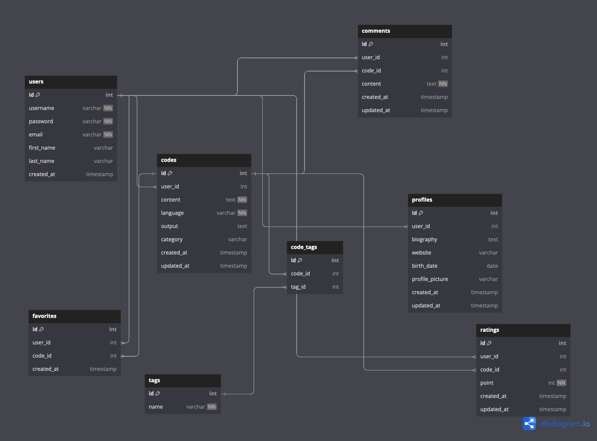

# The Compiler

**Proje Tanımı:** 

Bu platform, kullanıcıların web tarayıcıları üzerinden Python kodlarını kolayca yazmalarına, derlemelerine ve çalıştırmalarına olanak tanıyan bir çevrimiçi araçtır. Arayüz olarak web tabanlı çalışan bir işletim sistemini andıracaktır. Kullanıcılar, kullanıcı dostu bir kod düzenleyici kullanarak Python kodlarını yazabilir ve düzenleyebilirler. Ardından, kodlarını hızlıca derleyip çalıştırarak çıktılarını görebilirler. Platform aynı zamanda hata izleme ve hata ayıklama işlevleri sunarak kullanıcıların kodlarını geliştirmelerine yardımcı olur. Kullanıcılar, paylaşılabilir linkler oluşturarak kodlarını paylaşabilir ve işbirliği yapabilirler. Bu platform, Python öğrenme sürecini destekleyerek, kullanıcıların kodlama becerilerini geliştirmeyi amaçlamaktadır.

**Proje Kategorisi:** 

Developer, IDE, Eğitim, Python, İşletim Sistemleri vb...

**Referans Uygulama:**

[Online Python Compiler](https://www.onlinegdb.com/online_python_compiler)

**Uygulama Adresi:**

[webos.live](https://webos.live)

**Grup Adı:**

PORT80

**Proje Ekipi:**

Yiğit AKTÜRK, Yiğitcan UÇAR

1. [Proje Planı](/projeplani.pdf)
2. [Gereksinim Analizi](/gereksinimanalizi.md)
3. [Durum Diyagramı](/durumdiyagrami.md)
4. [Durum Senaryoları](/durumsenaryolari.md)
5. **VERİTABANI DİYAGRAMI:**

    
7. [Frontend](/frontend.md)
8. [Backend](/backend.md)
9. [Test](/test.md)
10. [Geliştrici ve Kullanıcı Dokümantasyonları](/dokumantasyon.md)
